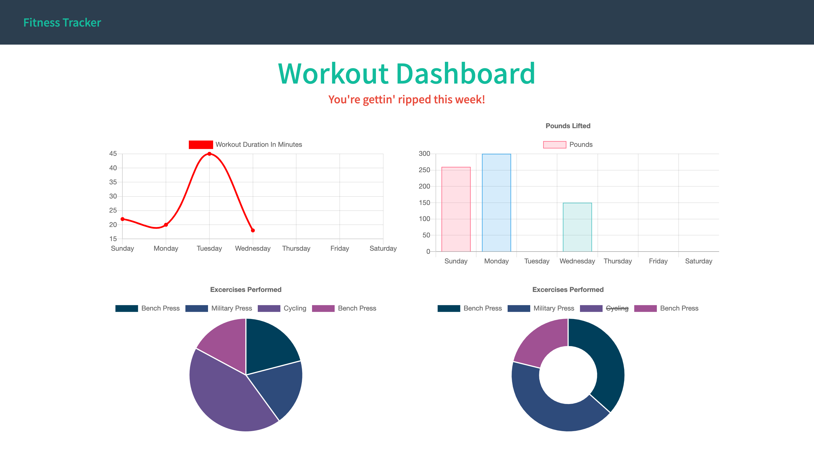

# Welcome to Workout Tracker! 0.1.0

## Description

Track your daily workouts with this simple fitness app. 

Just add your desired exercises to your daliy workout to view your progress. 

Technologies used
* Node.js
* Express
* Object-document mapping
* MongoDB with Mongoose Schema

Deployed Application: [https://workout-tracker-kassimariemc.herokuapp.com/](https://workout-tracker-kassimariemc.herokuapp.com/)

## License

Copyright &#169; 2020 [@kassimariemc](https://github.com/kassimariemc). 
This project is [MIT](https://choosealicense.com/licenses/mit/) licensed.

_____________________________________________________
> *This README was generated with &hearts; by [readme-generator](https://github.com/kassimariemc/README-generator)*
